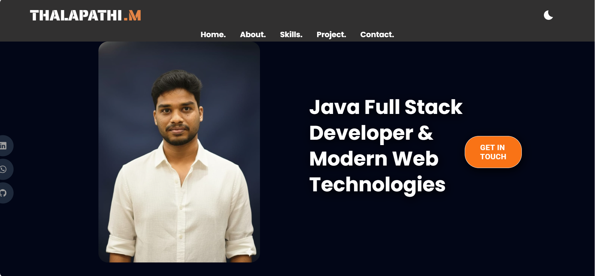
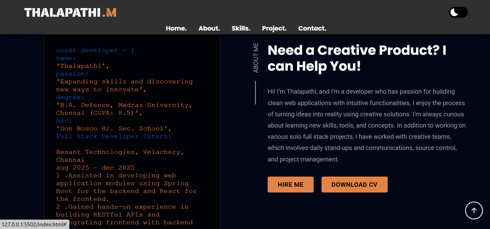
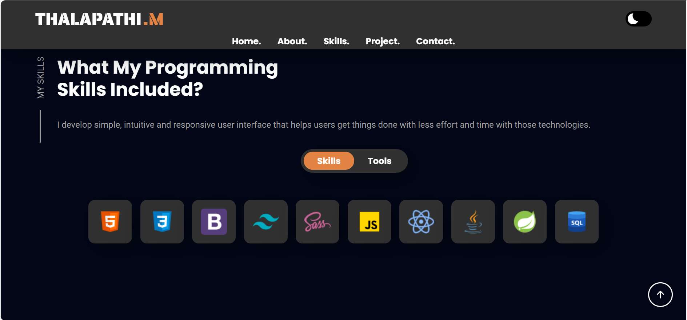
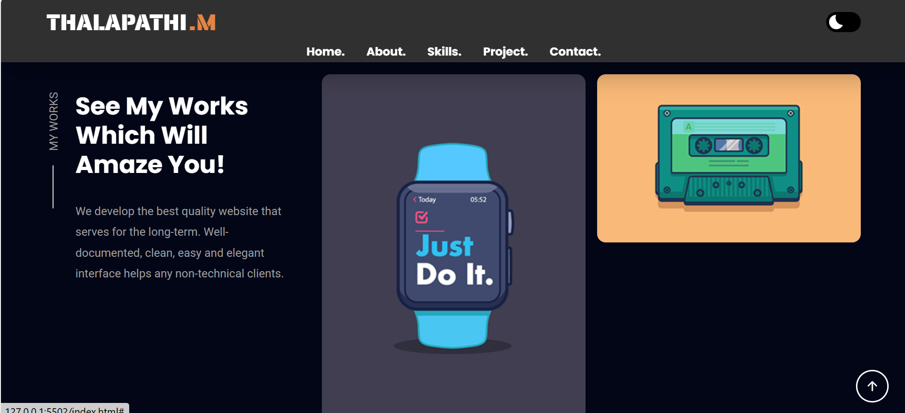

# 👨‍💻 Personal Portfolio Website

A modern, responsive personal portfolio website created to showcase my frontend development skills, projects, and contact details in a professional way.

---

---

## 🖼️ Preview

> Screenshots taken directly from the project

---

## ✨ Features
- Fully responsive design (Mobile / Tablet / Desktop)
- Sticky navigation bar with smooth scrolling
- Light & Dark theme toggle
- Animated sections for better UI experience
- Clean and simple user interface
- Single-page layout with clear sections

---

## 🛠️ Tech Stack
- HTML5
- CSS3 (Flexbox, Grid, Animations)
- JavaScript (DOM Manipulation, Events)

---

## 📂 Project Structure
"# THALAPATHI_PORTFOLIO" 
